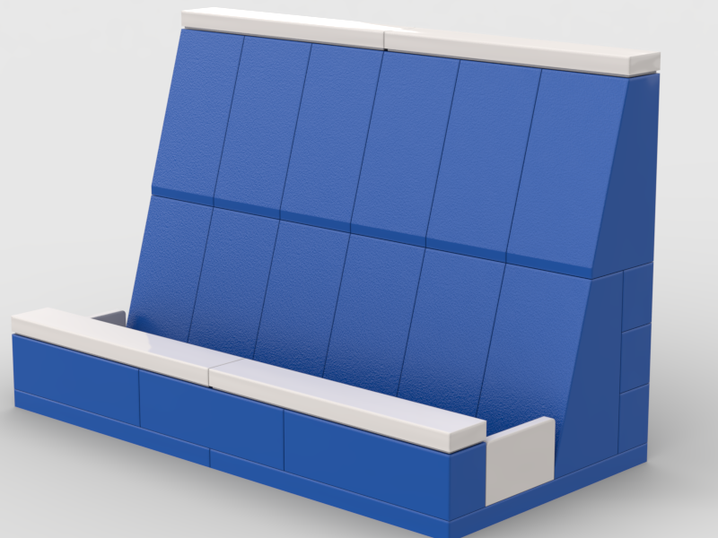
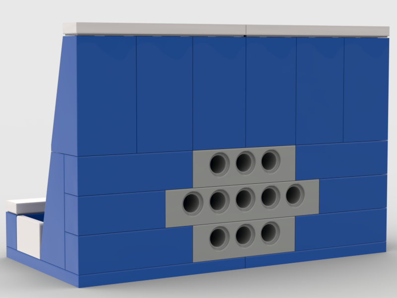
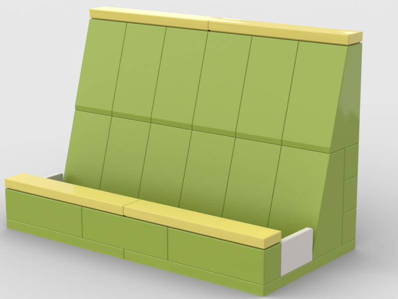
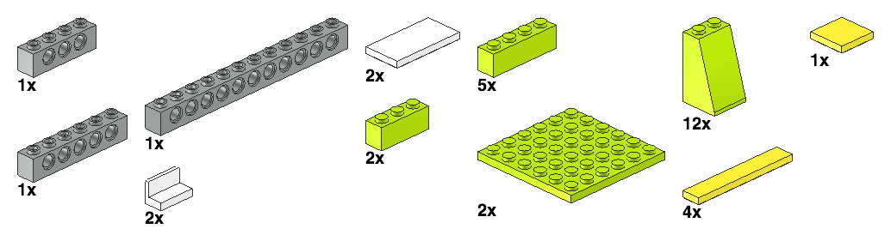

# LEGO® business card holder

## Inspiration

This was definitely inspired by LEGO's
[design, set 50425](https://brickset.com/sets/850425-1/Desk-Business-Card-Holder).

I really like the printed tiles in this set and who doesn't need more minifigs!
But those colors look like they just went with all of the primary colors.
We probably don't need a blank business card to fill in, but they made
it look nice.  Still, I can't imagine why LEGO made the back of this *straight*.
Clearly it should be sloped like every other business card holder made.

I'm sorry I don't include a minifig with my version.  I'm open to suggestions.

## version 2

I moved to [Studio](https://www.bricklink.com/v3/studio/download.page).
Studio imported the [LDR model](business_card_holder.ldr) just fine.

I've been wanting to swap out the 3895 Technic 1x12 brick because the color
showed on the sides and there's little reason to waste a $.60 part on this
when 3 cheaper parts will do.  Right now the blue 3010 is $.08 and the dark
bluish gray is also $.08, so you're saving $.34.

I then took the [Lime and Yellow version in Studio](business_card_holder2.io)
and made a [Blue and White version](business_card_holder2_blue.io).
The blue and white version now has
[PDF instructions](business_card_holder_v2_instructions.pdf).

## version 1

I did version 1 in [LeoCAD](https://www.leocad.org/) with Lime bricks and
yellow accents.
The [LeoCAD-generated instructions](leocad_v1_instructions/README.md) are
still included in this git repo.

### Parts Needed

| Part ID | Part Name | Quantity | Color | Color Code |
| ------- | --------- | -------- | ----- | ---------- |
| 3958 | Plate  6 x  6 | 2 | Lime | 27 |
| 3622 | Brick  1 x  3 | 2 | Lime | 27 |
| 3010 | Brick  1 x  4 | 5 | Lime | 27 |
| 3684c | Slope Brick 75  2 x  2 x  3 with Solid Studs | 12 | Lime | 27 |
| 4865b | Panel  1 x  2 x  1 with Rounded Corners | 2 | White | 15 |
| 3701 | Technic Brick  1 x  4 with Holes | 1 | Light Grey | 7 |
| 3894 | Technic Brick  1 x  6 with Holes | 1 | Light Grey | 7 |
| 3895 | Technic Brick  1 x 12 with Holes | 1 | Light Grey | 7 |
| 6636 | Tile  1 x  6 | 4 | Bright Light Yellow | 226 |
| 3068b | Tile  2 x  2 with Groove | 1 | Bright Light Yellow | 226 |
| 87079 | Tile  2 x  4 with Groove | 2 | White | 15 |

Swapping the Lime pieces, panels, and tiles you can make your own combinations.
I like Blue and White.  See [Design for Hackers](https://designforhackers.com/) for
color theory.

## Support

Please file
[github issues](https://github.com/chicks-net/lego-business-card-holder/issues)
for things not [already planned](TODO.md).
Refer to [CODE_OF_CONDUCT.md](CODE_OF_CONDUCT.md) to learn about our
expectations for contributors.

## Author

[Christopher Hicks](http://www.chicks.net)
is the primary designer of this model.  He has gotten
lots of assistance and wonderful feedback so noone
is pretending they are doing it all alone.
