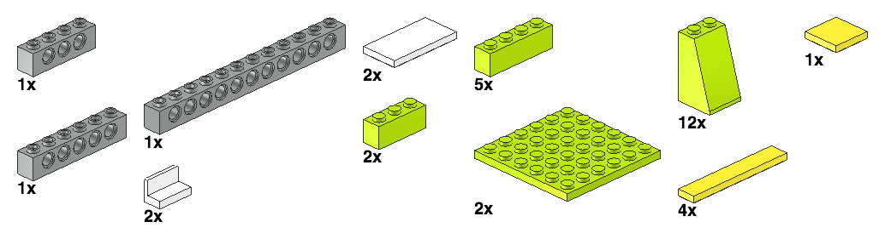

# LEGO® business card holder

## Inspiration

This was definitely inspired by LEGO's
[design 850425](https://brickset.com/sets/850425-1/Desk-Business-Card-Holder).

I really like the printed tiles in this set and who doesn't need more minifigs!
But those colors are pretty sad.  We probably don't need a blank business card to fill in,
but they made it look nice.  Still, I can't imagine why LEGO made the back of this *straight*.
Clearly it should be sloped like every other business card holder made.

I'm sorry I don't include a minifig with this.

## Parts Needed

| Part ID | Part Name | Quantity | Color | Color Code |
| ------- | --------- | -------- | ----- | ---------- |
| 3010 | Brick  1 x  4 | 5 | Lime | 27 |
| 3068b | Tile  2 x  2 with Groove | 1 | Bright Light Yellow | 226 |
| 3622 | Brick  1 x  3 | 2 | Lime | 27 |
| 3701 | Technic Brick  1 x  4 with Holes | 1 | Light Grey | 7 |
| 3894 | Technic Brick  1 x  6 with Holes | 1 | Light Grey | 7 |
| 3895 | Technic Brick  1 x 12 with Holes | 1 | Light Grey | 7 |
| 3958 | Plate  6 x  6 | 2 | Lime | 27 |
| 6636 | Tile  1 x  6 | 4 | Bright Light Yellow | 226 |
| 87079 | Tile  2 x  4 with Groove | 2 | White | 15 |
| 4865b | Panel  1 x  2 x  1 with Rounded Corners | 2 | White | 15 |
| 3684c | Slope Brick 75  2 x  2 x  3 with Solid Studs | 12 | Lime | 27 |

## Instructions

TODO: linkify

## Author

[Christopher Hicks](http://www.chicks.net)
is the primary designer of this model.  He has gotten
lots of assistance and wonderful feedback so noone
is pretending they are doing it all alone.
